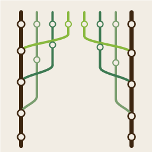

<h1>
  <picture>
    <source media="(prefers-color-scheme: dark)" srcset="assets/icon-dark.png">
    
  </picture>
  GitRove
</h1>

A fast, read-only Git GUI for developers working across multiple repos and worktrees simultaneously. Built with Rust and [egui](https://github.com/emilk/egui).

## Why

When using Claude Code to drive development across multiple microservices, you often have several worktrees open at once — one per feature or fix, spread across several repos. Standard Git GUIs either show one repo at a time, or are too heavyweight to keep open alongside everything else. GitRove keeps the full picture visible at a glance.

## Screenshots

_Screenshots coming soon._

<!-- 
  To add screenshots: place PNG files in assets/screenshots/ and reference them below, e.g.:
  
-->

## Features

- **Multi-repo sidebar** — all your repos in one tree view, with per-worktree change counts
- **Multi-worktree support** — all registered worktrees shown per repo, not just the main branch
- **Worktree search** — filter across all repos by name or branch prefix
- **Pending changes panel** — modified/added/deleted/untracked files with status badges
- **Commit graph** — linear history with branch name pills and relative timestamps
- **Diff view** — unified or side-by-side diff with line numbers and optional word wrap
- **Auto-refresh** — file watcher detects changes and updates the view automatically
- **"Add all repos in dir"** — point at your microservices root and all repos are discovered at once
- **Update notifications** — notified in-app when a new release is available

## What it does not do yet

GitRove is read-only in v1 — it does not stage, commit, push, or create branches. Fuller Git workflow support is planned for future releases. For now, Claude Code handles the writes.

## Installation

### Download

Pre-built Windows binaries are available on the [Releases](https://github.com/negatedx/GitRove/releases) page.

### Build from source

**Prerequisites:** Rust 1.78+ (via [rustup](https://rustup.rs))

```bash
git clone https://github.com/negatedx/GitRove.git
cd GitRove/src
cargo build --release
./target/release/gitrove.exe
```

## Usage

### Adding repos

On first launch the window will be empty. Click **+** in the sidebar header to open the file picker:

- **Select a git repo directly** — pick the repo root folder
- **Select a parent directory** — GitRove scans all subdirectories and adds every repo it finds

Repo paths are saved to `%APPDATA%\gitrove\settings.json` and restored on next launch.

### Worktree search

Type in the search box at the top of the sidebar. The tree filters live as you type, matching against worktree names and branch names. Matched worktrees are highlighted; repos with no matches are hidden.

Tip: if you use a consistent prefix like `feat/TICKET-123` across repos, typing that prefix instantly shows all related worktrees across every repo.

### Settings

Click the gear icon in the sidebar header to open Settings. From there you can adjust:

- **Theme** — Dark, Light, or follow the system setting
- **UI scale** — zoom the entire interface up or down
- **Font** — pick any installed monospace font; applied to diff and code views
- **Font size** — independent of UI scale
- **History limit** — how many commits to load per worktree
- **Diff mode** — unified (default) or side-by-side
- **Word wrap** — wrap long diff lines instead of scrolling horizontally

## Project layout

```
src/
  main.rs          — entry point, logging setup
  updater.rs       — background update check against GitHub releases API
  git/mod.rs       — repo discovery, worktree loading, diff, history (libgit2)
  state/mod.rs     — AppState, Settings, Selection, UiState
  watcher/mod.rs   — file system watcher (notify + debounce)
  ui/
    mod.rs         — App struct, eframe::App impl, panel layout
    sidebar.rs     — repo/worktree tree + search
    pending.rs     — pending changes file list
    graph.rs       — commit history graph
    diff.rs        — unified and side-by-side diff viewer
    settings.rs    — settings window
```

## Configuration

Settings file: `%APPDATA%\gitrove\settings.json`

```json
{
  "repo_paths": ["C:/Users/you/projects/my-repo"],
  "history_limit": 100,
  "theme": "Dark",
  "ui_scale": 1.0,
  "font_size": 14.0,
  "diff_side_by_side": false,
  "diff_word_wrap": false
}
```

## Dependencies

| Crate | Purpose |
|-------|---------|
| `egui` / `eframe` | Immediate-mode UI framework |
| `egui-phosphor` | Phosphor icon set for egui |
| `git2` | libgit2 bindings — all Git operations |
| `rayon` | Parallelism for multi-repo scanning |
| `notify` + `notify-debouncer-mini` | Cross-platform file watching |
| `reqwest` | Blocking HTTP for the update check |
| `serde` / `serde_json` | Settings persistence |
| `dirs` | Platform config directory paths |
| `chrono` | Commit timestamp formatting |
| `anyhow` | Error handling |
| `tracing` | Structured logging |
